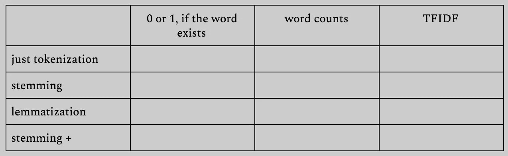
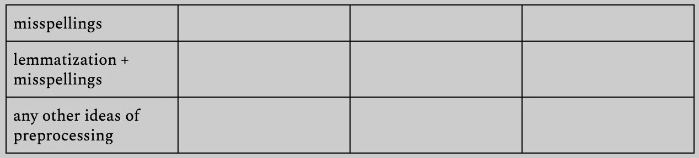

# Tweets

## Intro to Natural Language Processing. Sentiment Analysis

_Summary:_ This project is an introduction to natural language processing: bag of words, TFIDF, stemming, lemmatization,
stop-words, cosine similarity, n-grams, word2vec.

💡 [Tap here](https://new.oprosso.net/p/4cb31ec3f47a4596bc758ea1861fb624) **to leave your feedback on the project**. It's anonymous and will help our team improve your educational experience. We recommend that you complete the survey immediately after the project.

## Contents

1. [Chapter I](#chapter-i) \
   1.1. [Preamble](#preamble)
2. [Chapter II](#chapter-ii) \
   2.1. [Introduction](#introduction)
3. [Chapter III](#chapter-iii) \
   3.1. [Goals](#goals)
4. [Chapter IV](#chapter-iv) \
   4.1. [Instructions](#instructions)
5. [Chapter V](#chapter-v) \
   5.1. [Mandatory part](#mandatory-part)
6. [Chapter VI](#chapter-vi) \
   6.1. [Bonus part](#bonus-part)
7. [Chapter VII](#chapter-vii) \
   7.1. [Submission and peer-correction](#submission-and-peer-correction)

## Chapter I

### Preamble

Language is important to humans. We use it every day to transmit thoughts from one mind to another. It is like the air that we do not even notice. But did you know that it not only reflects reality, but also shapes it? If something has no word, it literally does not exist for us.

The Amondawa language has no word for "time," or even for periods of time such as "month" or "year. People do not refer to their age, but rather take on different names at different stages of their lives, or as they attain different statuses within the community [source](https://www.bbc.com/news/science-environment-13452711).

The language we use can change the way we see different colors. The Himba of northern Namibia — who have never set foot in a town — call the sky black and the water white, and for them blue and green share the same word. They have only five words for color, compared to the 11 basic color categories [source](https://www.bbc.co.uk/blogs/tv/entries/24bbc4b8-58f9-373d-a896-274ae453ef2a).

An example from an Aboriginal community in Australia — the Kuuk Thaayorre people. The cool thing about them is that they don't use words like "left" and "right," but everything is in cardinal directions: north, south, east, and west. They would say something like, "Oh, there's an ant on your southwest leg". Or, "Move your cup a little bit to the north-northeast". In fact, the way you say "hello" in Kuuk Thaayorre is to say, "Which way are you going?" And the answer should be, "North-northeast in the far distance. How about
you?" [source](https://www.ted.com/talks/lera_boroditsky_how_language_shapes_the_way_we_think/transcript?language=en).

## Chapter II

### Introduction

NLP (Natural Language Processing) is a field of knowledge and a set of techniques and algorithms that help process textual data and extract information from it. You have already worked with structured data — tables full of continuous and categorical characteristics. Text is an example of semi-structured data. You need to do something with it to use it in machine learning tasks, for example.

What can machines understand? That is right: numbers, vectors, and matrices. Imagine you have to solve a classification task with texts — predict a class for each of them. What can the features be? That is right: words can be the features. This is how the bag of words works.

You can create a matrix where the rows are document IDs and the columns are different words. But what can you put into the cells? The first idea is that you can put 1 if the word is in the document and 0 if it is not. The second idea is that you can count the words in the documents and use the numbers as values in the cells. The third idea is a bit more complicated, but can give a better result — TFIDF (term frequency — inverse document frequency). It gives higher weights to the words that are specific to the document and lower weights to the words that are ubiquitous.

But how do you count words? For your task, are "cat" and "cats" different words or the same? If you think they are the same in your task, then some preprocessing is required. The first technique is called stemming. It is simple: it just removes some suffixes, prefixes, and other extra stuff from the words. In our example, "cats" becomes "cat".

But what about "better" and "good"? Stemming will not help us in such cases. There is another technique called lemmatization. It transforms a word into its base form. In our example, "better" becomes "good".

Another problem is that real texts (especially on the Internet) are full of misspellings. Stemming and lemmatization will not help you in these cases. But you can use Levenshtein distance to find the words with the minimum number of corrections needed to transform one word into another. Some of them will be misspellings.

Actually, we can try another approach. What if we do not work with words, but with collocations (bigrams, trigrams, n-grams)? It will help us to catch "do" and "do not" — they will be different things in our texts. Before it was just "do" and "do not".

As you can see, there are many different ways of dealing with texts, but you got the main idea — transform texts into vector formats trying to find (or keep) better features for your task.

## Chapter III

### Goals

The goal of this project is to give you a first approach to NLP. You will try to preprocess text data, train different classifiers and try to solve a classification task with the best possible score.

## Chapter IV

### Instructions

* This project will be evaluated by humans only. You are free to organize and name your files as you wish.
* Here and throughout, we use Python 3 as the only correct version of Python.
* The standard does not apply to this project. However, you are asked to be clear and structured in the design of your source code.
* Place the datasets in the **data** subfolder.

## Chapter V

### Mandatory part

#### a. Task

In this project, you will work on sentiment analysis of tweets. You will need to predict whether a tweet is positive, negative, or neutral.

* Data preparation. Transform tweets into vectors using different approaches.
* Similarity. Find the top 10 most similar pairs of tweets using datasets with different preprocessing.
* Machine Learning. Perform sentiment analysis using different machine learning algorithms and different datasets with different preprocessing.

#### b. Dataset

* You will work with the dataset of tweets. The tweets will be labeled as positive, negative, and neutral. That is it. The [source](./datasets/p00_tweets.zip) of the dataset.

> **Note:** You can find the dataset on the project page: "p00_tweets.zip"

#### c. Implementation

* You can work in Jupyter notebooks. The notebooks should be well formatted. You need to make a split on the train and test (20%) datasets with stratification.
* You can use the NLTK library or any other library you find useful.
* You can enrich the dataset with any other dataset you find useful or collect your own.

**Data preparation**

You need to try different approaches:

You can use any of the cleaning techniques above if you find it useful.

You can also try using [stop-words](https://en.wikipedia.org/wiki/Stop_word) to remove the words that create noise and no signal.

**Similarity**

Use the different datasets you prepared in the task above and cosine similarity to find the top 10 similar pairs of tweets.

**Machine Learning**

Try different algorithms and different datasets you prepared earlier to solve the classification task - sentiment analysis.

#### d. Submission

You must achieve an accuracy of at least 0.832 on the test dataset.

Your repository should contain one or more notebooks with your solutions.

## Chapter VI

### Bonus Part

* Try using word2vec to get better vectorization of text.
* Try to get a better accuracy on the test dataset — 0.851.
* Try to get an even better accuracy on the test dataset — 0.873.

## Chapter VII

### Submission and peer-connection

Submit your work to your Git repository as usual. Only the work on your repository will be graded.

Here are the things your peer reviewer will need to check:

* There are all the prepopulated commits;
* The top 10 most similar tweets for each type of preprocessing;
* The score achieved on the test dataset.
